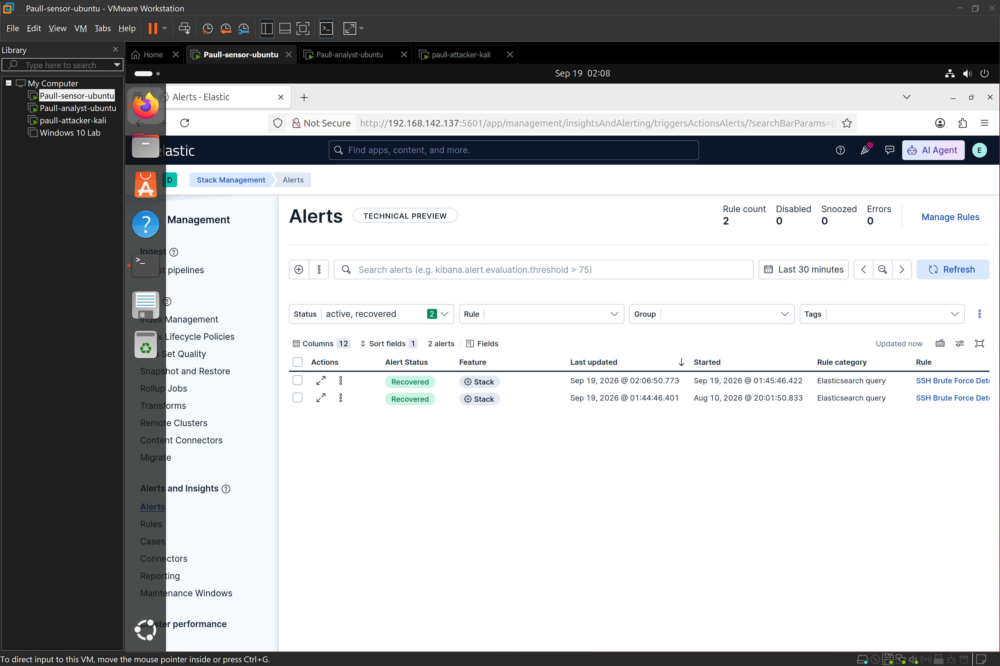
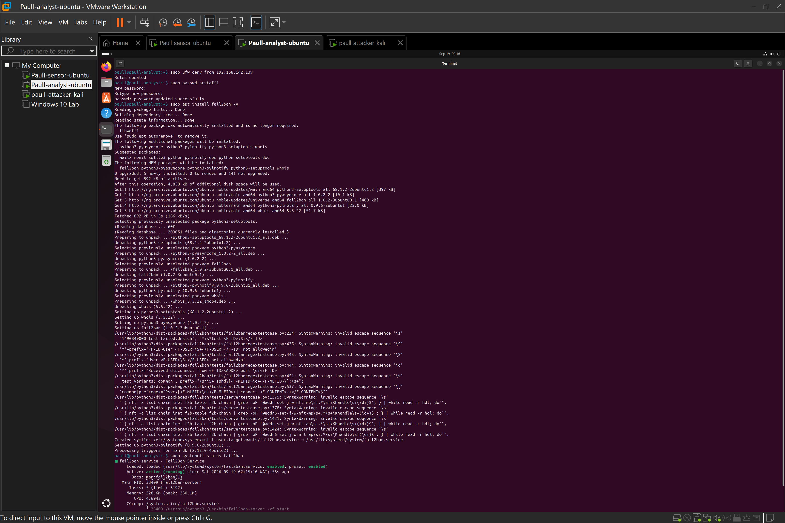

# Incident-response-simulation

## Objective
Chain the individual detection capabilities built across my previous Hands-on Lab  into a single, continuous simulated incident — from initial reconnaissance through compromise, detection, correlation, containment, and recovery — replicating the full lifecycle a SOC analyst works through end-to-end, rather than isolated attack/detection exercises. This lab was run entirely against a self-built home lab environment (Kali attacker, Ubuntu victim, Ubuntu SIEM with Elastic Stack), to demonstrate my ability to build and operate detection infrastructure.

## Environment
| Role | Hostname | Tool Stack |
|---|---|---|
| Attacker | paull-attacker-kali | Kali Linux, Nmap, Hydra |
| Victim | paull-analyst | Ubuntu Server, OpenSSH, Filebeat |
| SIEM | paull-sensor | Ubuntu Server, Elasticsearch, Kibana |

## Step 1 Attack Chain Executed

**1. Reconnaissance:**
```bash
nmap -sV 192.168.142.138
```

**2. Credential brute force:**
```bash
hydra -l hrstaff1 -P hrstaff1_wordlist.txt ssh://192.168.142.138
```

**3. Successful compromise, followed by simulated post-exploitation:**
```bash
ssh hrstaff1@192.168.142.138
whoami
sudo -l
cat /etc/passwd
```

All three stages were run in immediate succession from the same attacker host, simulating a realistic compressed attack timeline, different from isolated testing done in my previous Labs individually.

## Step 2 Detection (Ubuntu-SIEM / Kibana)

The existing alert rule built in Elastic (**SSH Brute Force Detection - Failed Password Threshold**) fired automatically against this activity with no reconfiguration required — confirming the detection built earlier generalizes to a real attack sequence.

**Confirmed in Kibana Discover:**
- Repeated `Failed password for hrstafff1` entries from my kali  attacker IP
- A subsequent `Accepted password for hrstaff1` entry marking successful compromise
- Alert instance generated under Alerts and Insights → Alerts



## Step 3  Analysis & Correlation

**Scope determination:**
- **Single compromised account:** `hrstaff1`
- **Single affected host:** paull-analyst (Ubuntu-Victim)
- **Single attacker source:** paull-attacker-kali

**Timeline correlation:** the Nmap reconnaissance scan, Hydra brute-force burst, and successful login were all correlated by source IP and tight temporal proximity within Kibana Discover — all three stages originated from the same source IP within a short window, consistent with a single continuous attack rather than unrelated or separate events.

**Assessment:** this pattern — reconnaissance immediately followed by credential brute-forcing and prompt post-login enumeration commands (`whoami`, `sudo -l`, `cat /etc/passwd`) — is consistent with an opportunistic, automated attack against a weakly-secured SSH service, rather than a targeted, sophisticated intrusion. The `sudo -l` command in particular is a classic immediate post-compromise step, used to check for privilege escalation paths.

## Step 4 Containment & Recovery (Executed)

**1. Attacker IP blocked at the host firewall:**
```bash
sudo ufw deny from 192.1687.142.139
sudo ufw status
```


**2. Compromised account's password reset:**
```bash
sudo passwd hrstaff1
```
Password rotated to a strong, non-wordlist value, closing the immediate access vector.

**3. fail2ban installed for future automated prevention:**
```bash
sudo apt install fail2ban -y
sudo systemctl status fail2ban
```



## Incident Report

```
Incident ID: Hrstaff1-001
Date/Time Detected: Sep 19, 2026 @ 01:45:08
Alert Source: Ubuntu-SIEM (forwarded auth.log via Filebeat → Elasticsearch → Kibana alert rule)

Summary of Activity:
An external host conducted a service-version reconnaissance scan (Nmap) against 
Ubuntu-Victim, immediately followed by an automated SSH credential brute-force attack 
(Hydra) targeting the account "hrstaff1." The attack succeeded, and the attacker
executed basic post-exploitation enumeration commands (whoami, sudo -l, cat /etc/passwd) 
consistent with initial post-compromise reconnaissance.

Timeline:
sep 19, 2026 @ 01:43: 00 - Nmap service scan initiated against Ubuntu-Victim
sep 19, 2026 @ 01:46:56 - Hydra brute-force attempts begin against SSH (port 22), account "hrstaff1"
sep 19, 2026 @ 01:45:08 - Kibana alert rule triggered on failed-password threshold breach
sep 19, 2026 @ 01:46:56 - Successful authentication ("Accepted password for hrstaff") recorded
[Time not documented during my investigation, but i ran the attack immediately i gained SSH access] Post-exploitation commands executed via authenticated SSH session
sep 19, 2026,5mins after detection - Attacker IP blocked via ufw; hrstaff1 password reset; fail2ban installed

Indicators of Compromise:
- Source IP: 192.168.142.139
- Target service: SSH (port 22)
- Target account: hrstaff1
- Ports scanned (Nmap): 22\80
- Failed authentication count: 14 - 1 successful

Root Cause:
Weak, guessable SSH credentials on the "hrstaff1" account combined with the absence of 
any account lockout and rate-limiting policy, allowing unlimited automated authentication 
attempts against the SSH service.

Containment Actions Taken:
- Attacker source IP blocked at the host firewall level (ufw deny)

Recovery Actions:
- Compromised account password reset to a strong, non-dictionary value
- fail2ban installed to provide automated brute-force rate-limiting and IP banning 
  for future attempts

Lessons Learned:
- SSH password authentication alone is insufficient for internet-facing or 
  security-sensitive hosts; key-based authentication should be enforced going forward
- No rate-limiting or lockout policy existed prior to this incident — fail2ban's 
  installation directly addresses this gap
- Multi-factor authentication would have prevented account compromise even with a 
  successfully guessed password
- The existing Kibana alert threshold (>5 failed attempts within 1 minute) performed 
  correctly and required no tuning to catch this live attack chain, validating the 
  detection logic built in my previous lab
- Recommend extending detection to also alert on `sudo -l` or other sensitive 
  post-login commands executed shortly after a first-time or previously-failed-then-
  succeeded login, to catch post-exploitation activity specifically, not just the 
  initial brute force
```


## Tools Used
- Kali Linux, Nmap, Hydra
- Ubuntu Server, OpenSSH, ufw, fail2ban
- Elastic Stack (Elasticsearch, Kibana), Filebeat
